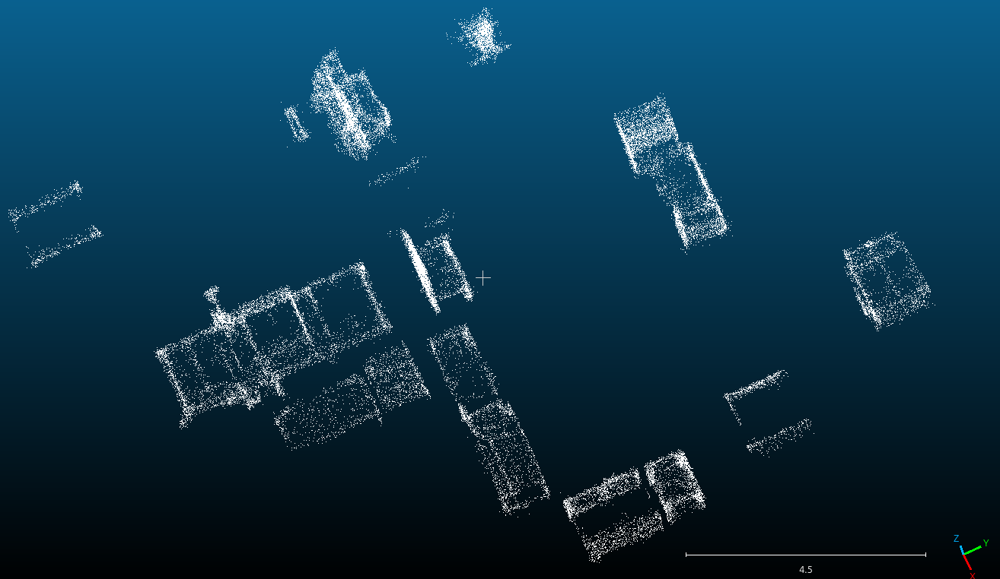
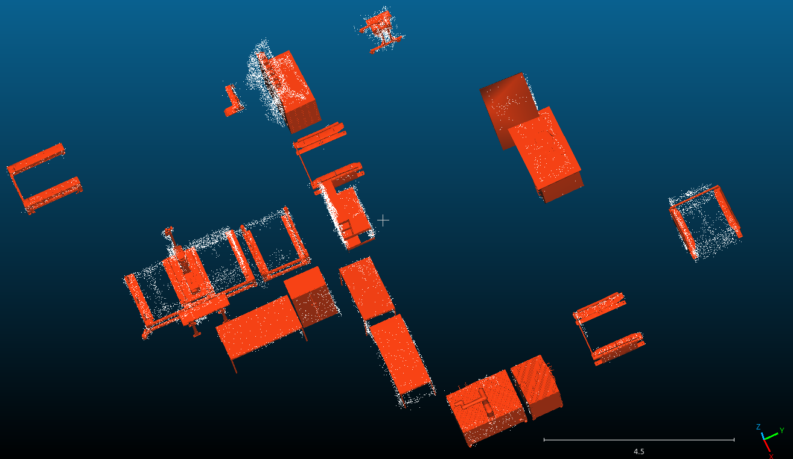

# CAD-to-Scene Point Cloud Registration

This repository contains the point cloud registration pipeline used to align CAD-derived point clouds with segmented scene point clouds.

The goal is to convert or subsample CAD geometry into a point cloud, register it to a segmented object extracted from a real scene, save the estimated transformation matrix, and export the aligned CAD point cloud.

## Project Context

In the project, a real scene was segmented into point cloud clusters. Each cluster represented a candidate object or scene part. CAD models were then converted or sampled into point clouds and aligned with these segmented scene clusters.

The workflow was used to:

- generate CAD proxy point clouds.
- segment real scene point clouds into clusters.
- register CAD point clouds to scene clusters.
- refine the alignment using ICP.
- save transformation matrices.
- export registered CAD point clouds.
- visually inspect the CAD-to-scene alignment.

## Scene Registration Example

The following figures show the scene point cloud before and after CAD-to-scene registration.

### Before CAD Registration

The scene initially contains only the segmented point cloud clusters extracted from the real scan.



### After CAD Registration

After registration, the CAD models are aligned with the segmented scene clusters using the estimated transformation matrices.



## Main Pipeline

1. Load the CAD model or CAD-derived point cloud.
2. Convert or subsample the CAD geometry into a point cloud.
3. Load the segmented scene point cloud.
4. Apply optional scaling if CAD and scene units are different.
5. Apply an initial transform.
6. Refine the alignment using ICP.
7. Save the final transformation matrix.
8. Export the registered CAD point cloud.

## Installation

```bash
python3 -m venv .venv
source .venv/bin/activate
pip install --upgrade pip
pip install -r requirements.txt
